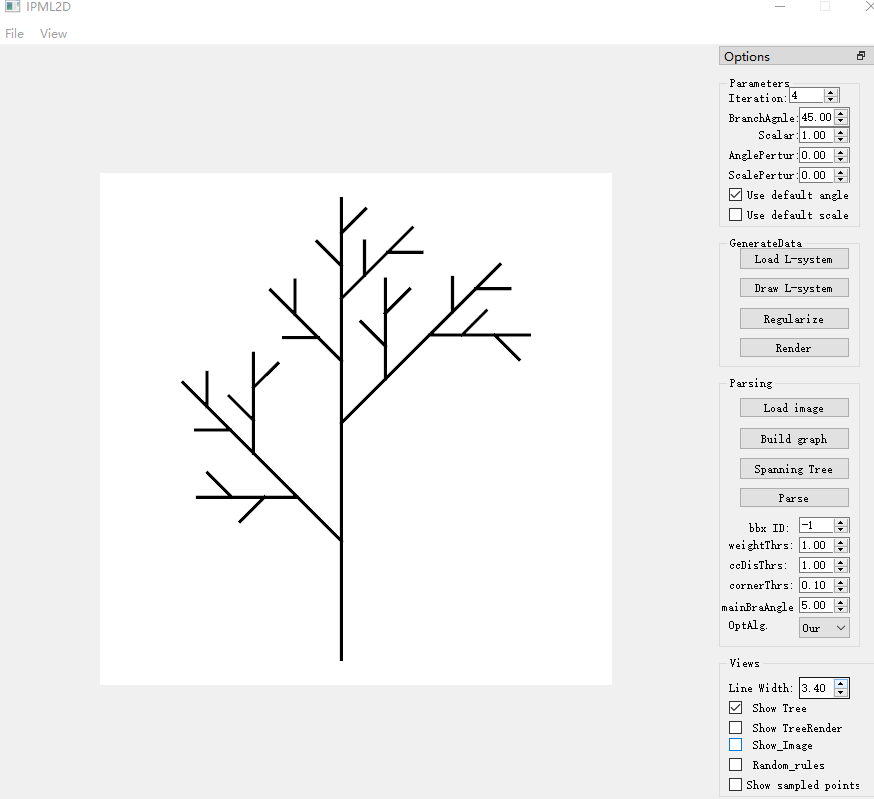
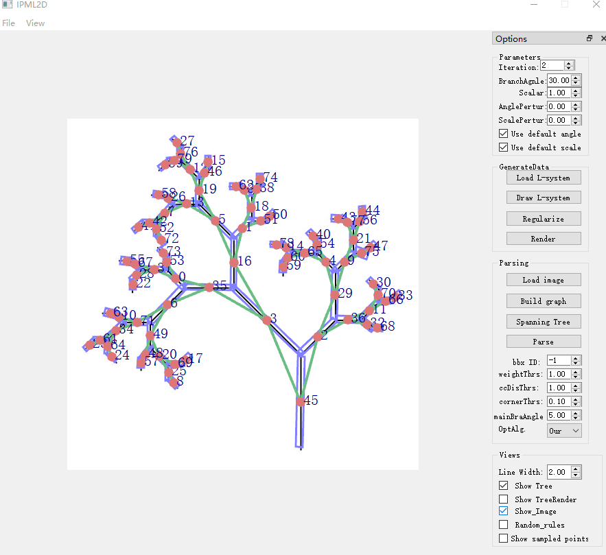
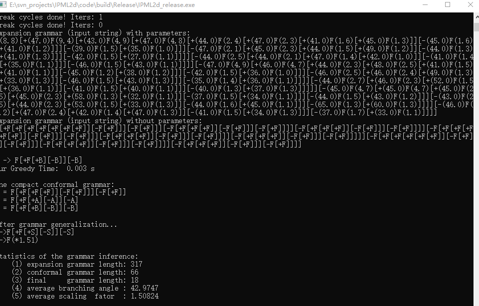

# L-system Inference

## Abstract
This is a C++ implementation of generating datasets and inferring L-system from an input image with branching structures. 

## Requirements
1. Camke >= 2.8     
2. OpenGL     
3. Boost    
4. Qt5     

## Compile
Please use Cmake to generate the solution files

## Usage
1. Draw and render L-systems:  
```    
(1) Use the button 'Load L-system' to load a L-system. The examples shown in the paper is located in the folder of 'L-systems-examples'. Note: If you want to laod random rules for generating training dataset, please check 'Random-rules' before loading the L-system file.     
(2) After setting the number of 'Iteration', push 'Draw L-system' to draw the current L-system.
(3) If you want to save the drawing into file, plase firstly check 'Show_TreeRender', then press 'Render'.
```   


2. Grammar inference
```     
(1) Use the button 'Load image' to load the image with branching structures, and check 'Show_tree' to display it. Note that the file (.txt) containg detected boudnding box should be placed in the same folder. Please the examples in 'test-examples'.    
(2) Press 'Build graph' and 'Spanning tree' to build the n-ary tree. The 'Spanning tree' may be performed 1 or 2 times.
(3) Press 'Parse' to infer the grammar. Here you can choose different grammar inference nethods: ours, SA (simulated annealing), GA (genetic algorithm). 
```     
 

3. Output result
 